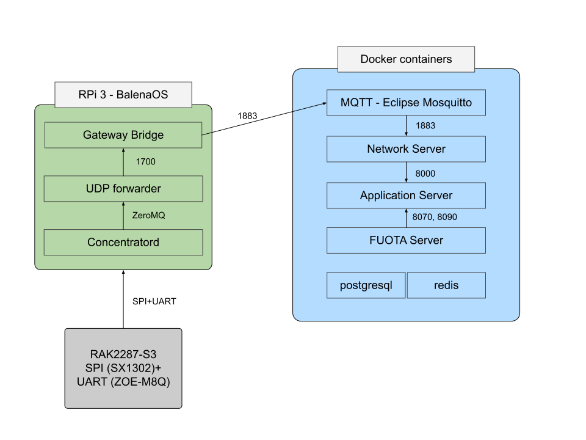

## Multicontainer docker setup for chirpstack LoraWAN gateway

### Services

- chirpstack-concentratord
- chirpstack-gateway-bridge
- chirpstack-udp-forwarder

### Setup used

* Raspberry Pi 3 (64-bit BalenaOS)
* RAK2287 mini-PCIe LPWAN concentrator
* RAK2287 Pi HAT

### System

